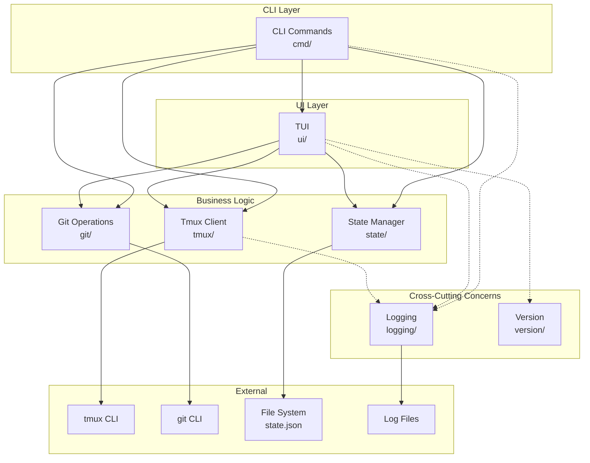
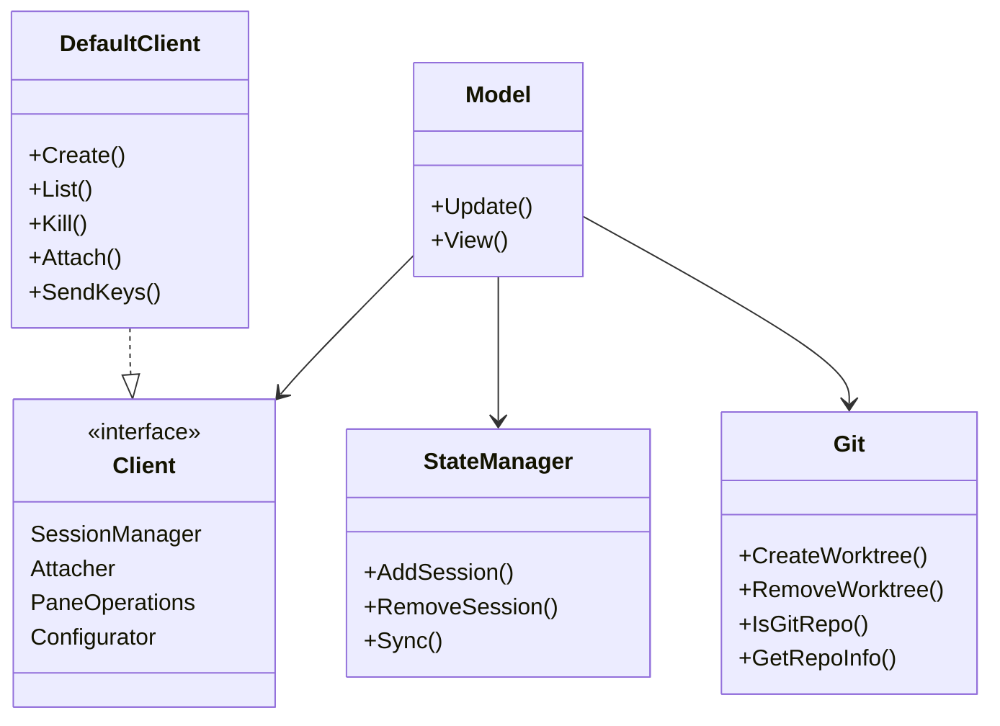
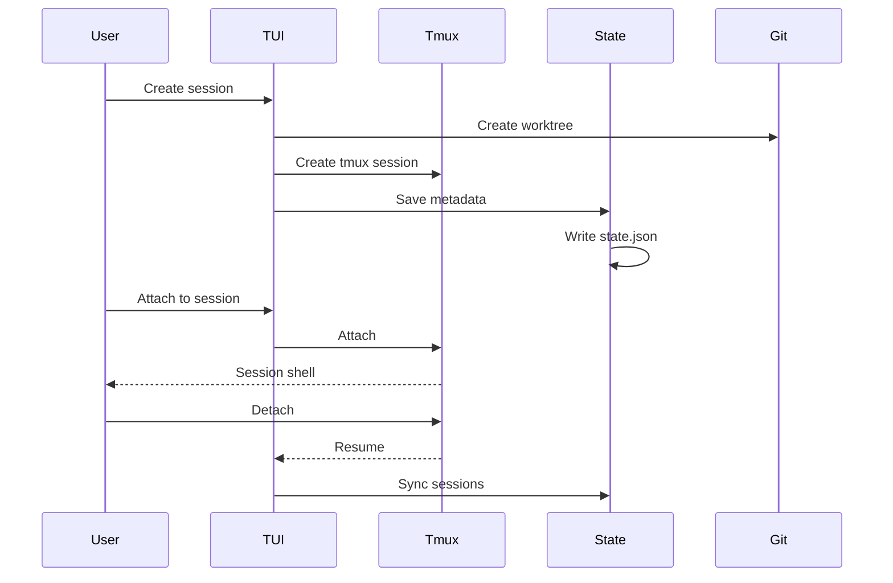
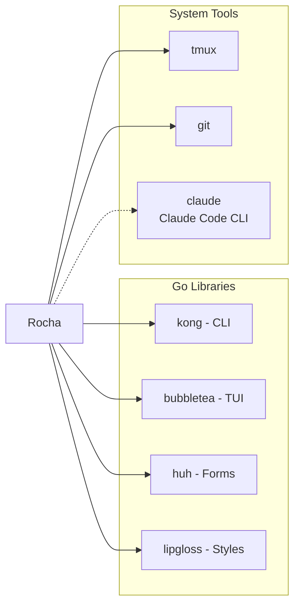

# Rocha Architecture

TUI application for managing Claude Code sessions via tmux with git worktree support.

## System Overview

### Cross-Cutting Concerns

Components shown with dotted lines (-.->) are **cross-cutting concerns** - they're used across multiple layers but don't participate in the main architectural flow:

- **logging/**: Structured logging (slog) used by cmd, ui, and tmux for debugging and audit trails
  - No business logic depends on logging
  - Can be disabled/redirected without affecting core functionality
  - Used for: operation traces, error diagnostics, debugging

- **version/**: Version and tagline constants
  - Read-only data used for display
  - No behavioral dependencies

These packages are designed to be:
- **Non-invasive**: Removing them doesn't break business logic
- **Uni-directional**: They don't call back into application code
- **Replaceable**: Can swap implementations (e.g., different log backends)

## Component Architecture

## Data Flow

## Packages

### Core Application Packages

#### cmd/
CLI command handlers using Kong framework.
- `RunCmd` - Start TUI
- `AttachCmd` - Attach to session
- `StatusCmd` - Status bar integration
- `SetupCmd` - Shell integration
- `StartClaudeCmd` - Bootstrap Claude Code with hooks (hidden command)
- `NotifyCmd` - Handle Claude hook events (hidden command)
- `PlaySoundCmd` - Play notification sounds (hidden command)

#### ui/
Bubble Tea TUI implementation.
- Session list view
- Session creation forms
- State machine (list, creating, confirming, filtering)

#### tmux/
Tmux abstraction layer with dependency injection.
- `Client` interface - Tmux operations
- `DefaultClient` - Implementation via tmux CLI
- `Monitor` - Background session monitoring

#### state/
Persistent session state management.
- JSON storage with file locking
- Session metadata (git info, status, timestamps)
- Sync with tmux sessions

#### git/
Git worktree operations.
- Create/remove worktrees
- Branch detection
- Repository metadata extraction

### Cross-Cutting Concerns

#### logging/
Structured logging with slog (used by cmd, ui, tmux).
- OS-specific log directories
- JSON log format
- Non-blocking operation tracing

#### version/
Version and tagline constants (used by ui).
- Build-time version information
- Application tagline for display

## Dependencies

**Go Libraries:**
- `kong` - CLI framework with dependency injection
- `bubbletea` - Terminal UI framework
- `huh` - Form components
- `lipgloss` - Styling
- `uuid` - UUID generation
- `unix` - File locking

**External Tools:**
- `tmux` - Terminal multiplexer (required)
- `git` - Version control (required for worktrees)
- `claude` - Claude Code CLI (bootstrapped automatically, dotted line indicates it's spawned not directly called)

<!-- Keep this document more visual than textual, an image is better than 1000 words -->