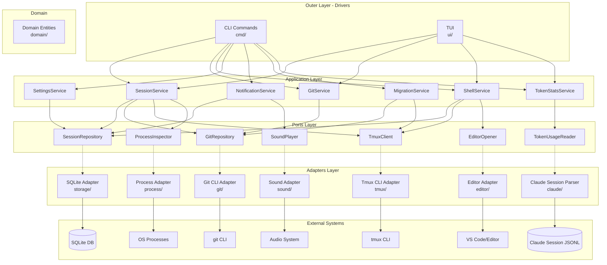
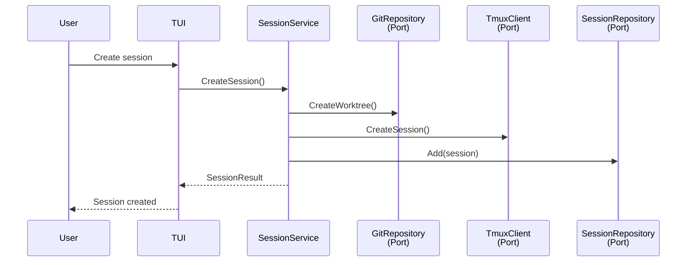
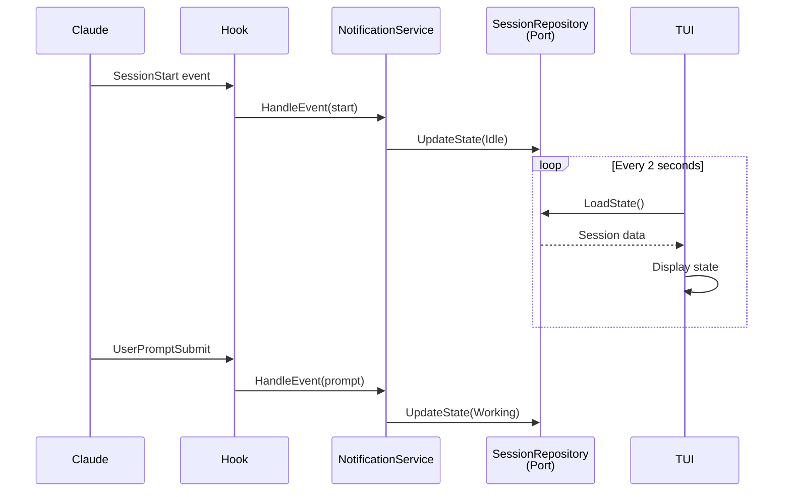
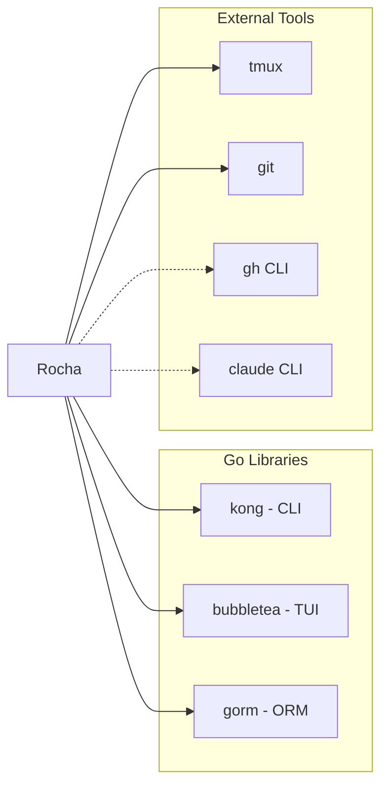

# Rocha Architecture

TUI application for managing Claude Code sessions via tmux with git worktree support.

## Hexagonal Architecture Overview



### Architecture Layers

1. **Drivers (Outer Layer)**: CLI commands and TUI - entry points that use services
2. **Application Services**: Business logic orchestration - facade to the domain
3. **Domain**: Core entities and business rules
4. **Ports**: Interface definitions - contracts between layers
5. **Adapters**: Infrastructure implementations - connect to external systems

### Key Principle

- **CLI and UI only depend on Services** - never on Ports or Adapters directly
- **Services orchestrate Ports** - implement business use cases
- **Adapters implement Ports** - provide infrastructure

## Data Flow

### Session Creation Flow



### State Update Flow (Hook Events)



### Hook Event Mapping

| Hook Event | New State | Symbol | Meaning |
|------------|-----------|--------|---------|
| `SessionStart` | `StateIdle` | ○ (yellow) | Session initialized |
| `UserPromptSubmit` | `StateWorking` | ● (green) | User submitted prompt |
| `PreToolUse` (AskUserQuestion) | `StateWaiting` | ◐ (red) | Claude asking question |
| `PostToolUse` (AskUserQuestion) | `StateWorking` | ● (green) | User answered question |
| `PostToolUseFailure` | `StateWorking` | ● (green) | Tool failed, continuing |
| `PermissionRequest` | `StateWaiting` | ◐ (red) | Needs user permission |
| `SubagentStart` | `StateWorking` | ● (green) | Delegating to subagent |
| `SubagentStop` | `StateWorking` | ● (green) | Subagent completed |
| `PreCompact` | `StateWorking` | ● (green) | Compressing context |
| `Setup` | `StateWorking` | ● (green) | Repository setup |
| `Stop` | `StateIdle` | ○ (yellow) | Claude finished |
| `SessionEnd` | `StateExited` | ■ (gray) | Claude exited |

## Package Structure

```
internal/
├── cmd/           # CLI commands (drivers)
├── ui/            # TUI components (drivers)
├── theme/         # Centralized colors and lipgloss styles
├── services/      # Application services
├── domain/        # Domain entities
├── ports/         # Interface definitions
├── adapters/      # Infrastructure implementations
│   ├── storage/   # SQLite repository
│   ├── git/       # Git CLI operations
│   ├── tmux/      # Tmux CLI operations
│   ├── editor/    # Editor integration
│   ├── sound/     # Sound playback
│   ├── process/   # Process inspection
│   └── claude/    # Claude session file parsing
├── config/        # Configuration and paths
└── logging/       # Structured logging
```

### Services

| Service | Responsibility |
|---------|----------------|
| SessionService | Session lifecycle (create, kill, archive) |
| GitService | Git and worktree operations |
| ShellService | Tmux pane operations, editor, shell sessions |
| SettingsService | Session configuration (claudedir, permissions) |
| NotificationService | Hook event handling, sounds |
| MigrationService | Move sessions between ROCHA_HOME directories |
| TokenStatsService | Parse Claude session files for token usage stats |

### Ports (Interfaces)

| Port | Methods |
|------|---------|
| SessionRepository | Add, Get, List, Delete, Update*, LoadState, SaveState |
| GitRepository | CreateWorktree, RemoveWorktree, IsGitRepo, GetRepoInfo |
| TmuxClient | CreateSession, KillSession, ListSessions, SendKeys |
| EditorOpener | Open |
| SoundPlayer | Play |
| ProcessInspector | GetClaudeSettings |
| TokenUsageReader | GetTodayUsage |

## Dependencies



## Testing

```
test/integration/
├── harness/           # Test utilities
└── *_test.go          # CLI integration tests
```

<!-- Keep this document visual - diagrams over text -->
