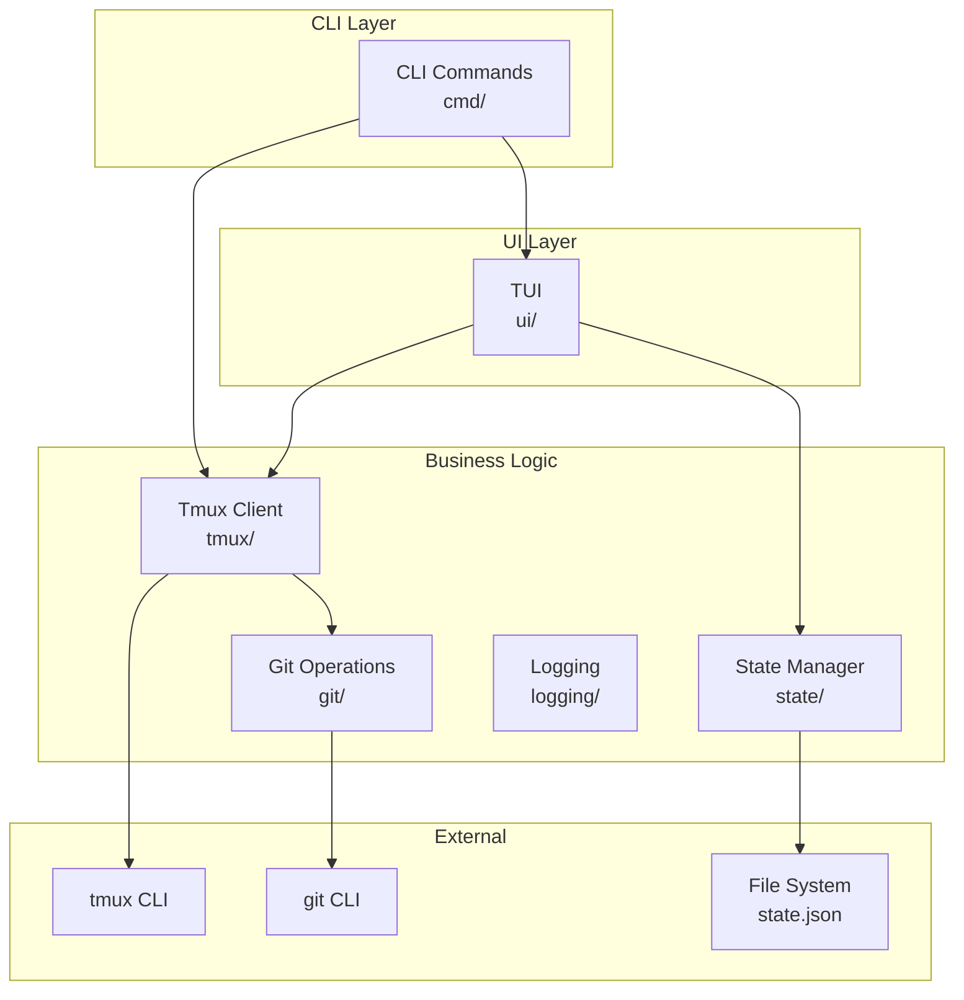
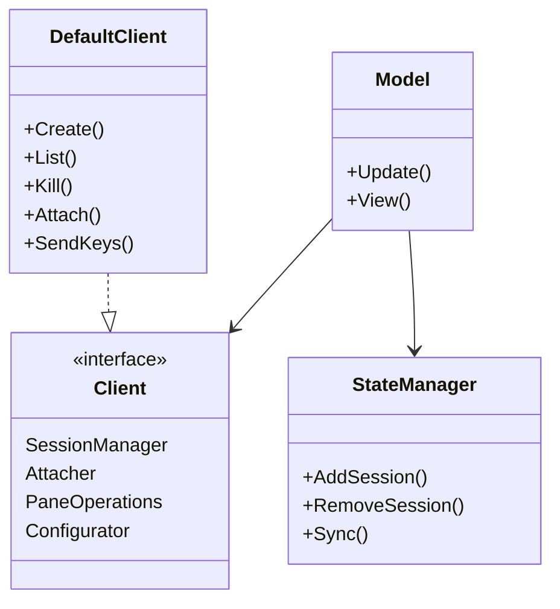
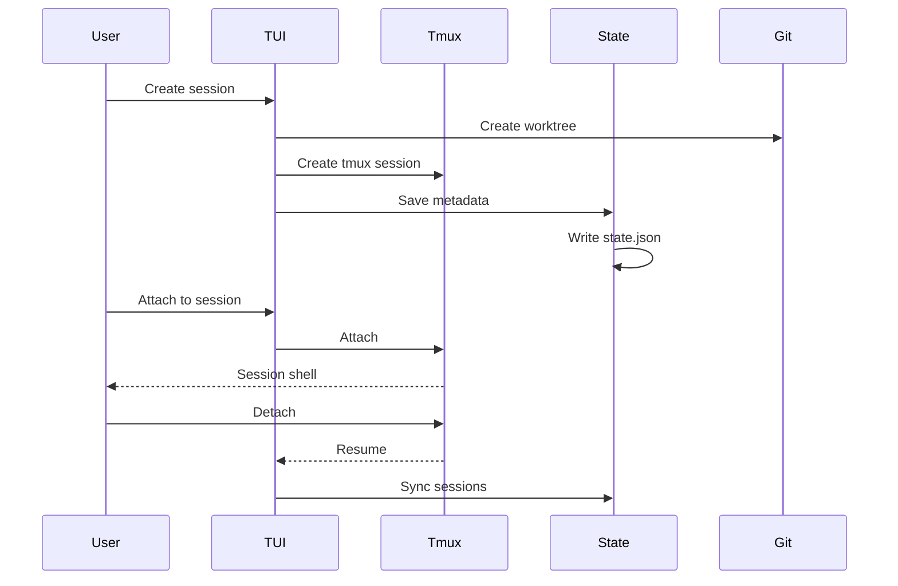
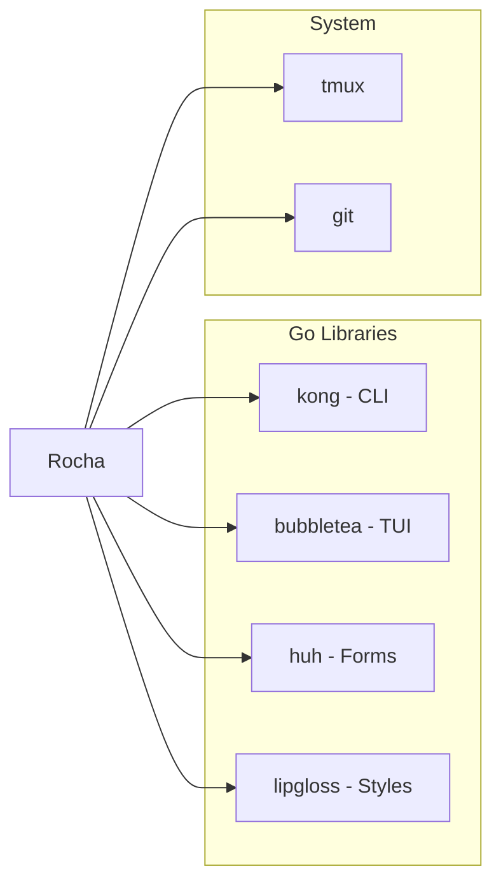

# Rocha Architecture

TUI application for managing Claude Code sessions via tmux with git worktree support.

## System Overview

## Component Architecture

## Data Flow

## Packages

### cmd/
CLI command handlers using Kong framework.
- `RunCmd` - Start TUI
- `AttachCmd` - Attach to session
- `StatusCmd` - Status bar integration
- `SetupCmd` - Shell integration

### ui/
Bubble Tea TUI implementation.
- Session list view
- Session creation forms
- State machine (list, creating, confirming, filtering)

### tmux/
Tmux abstraction layer with dependency injection.
- `Client` interface - Tmux operations
- `DefaultClient` - Implementation via tmux CLI
- `Monitor` - Background session monitoring

### state/
Persistent session state management.
- JSON storage with file locking
- Session metadata (git info, status, timestamps)
- Sync with tmux sessions

### git/
Git worktree operations.
- Create/remove worktrees
- Branch detection
- Repository metadata extraction

### logging/
Structured logging with slog.
- OS-specific log directories
- JSON log format

### version/
Version and tagline constants.

## Dependencies

**Go Libraries:**
- `kong` - CLI framework with dependency injection
- `bubbletea` - Terminal UI framework
- `huh` - Form components
- `lipgloss` - Styling
- `uuid` - UUID generation
- `unix` - File locking

**External Tools:**
- `tmux` - Terminal multiplexer
- `git` - Version control
