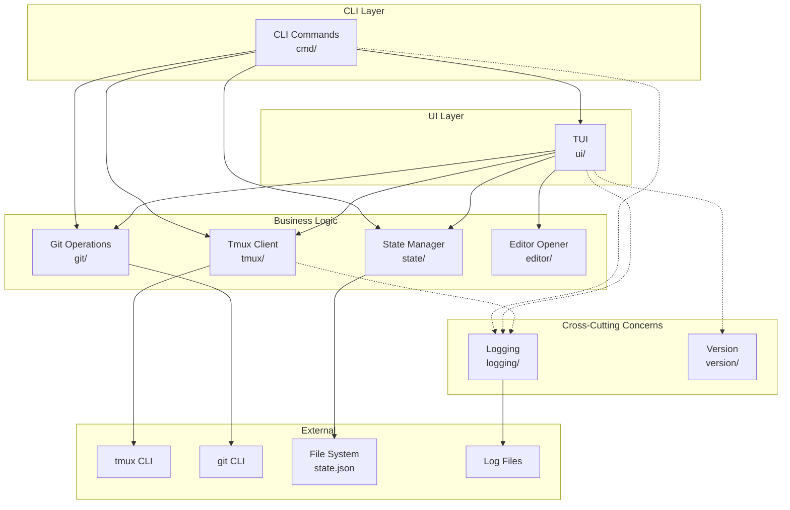
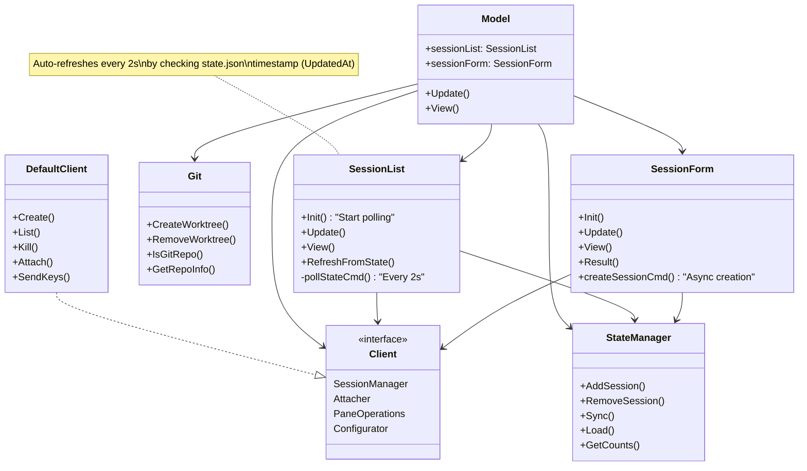
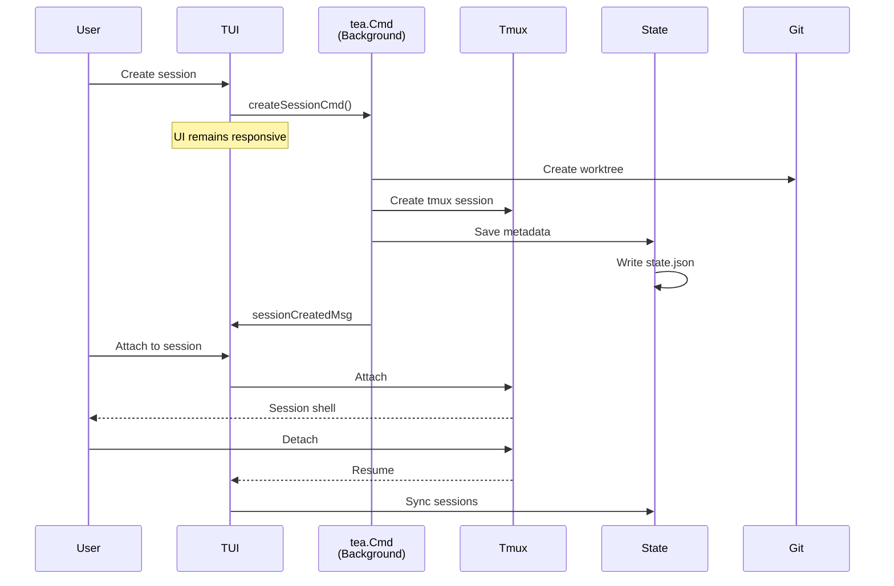
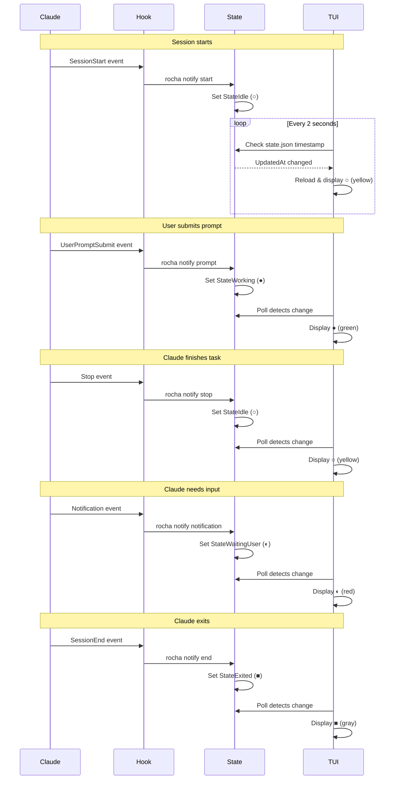
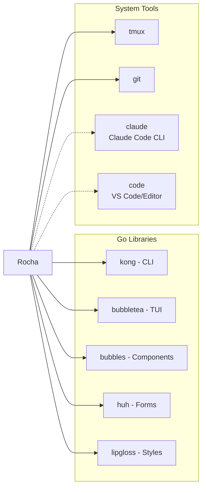

# Rocha Architecture

TUI application for managing Claude Code sessions via tmux with git worktree support.

## System Overview

### Cross-Cutting Concerns

Components shown with dotted lines (-.->) are **cross-cutting concerns** - they're used across multiple layers but don't participate in the main architectural flow:

- **logging/**: Structured logging (slog) used by cmd, ui, and tmux for debugging and audit trails
  - No business logic depends on logging
  - Can be disabled/redirected without affecting core functionality
  - Used for: operation traces, error diagnostics, debugging

- **version/**: Version and tagline constants
  - Read-only data used for display
  - No behavioral dependencies

These packages are designed to be:
- **Non-invasive**: Removing them doesn't break business logic
- **Uni-directional**: They don't call back into application code
- **Replaceable**: Can swap implementations (e.g., different log backends)

## Component Architecture

## Data Flow

### Session Creation Flow

### State Update Flow (Auto-refresh)

### Hook Event Mapping

Claude Code hooks trigger state transitions:

| Hook Event | Command | New State | Symbol | Meaning |
|------------|---------|-----------|--------|---------|
| `SessionStart` | `rocha notify start` | `StateIdle` | ○ (yellow) | Session initialized and ready |
| `UserPromptSubmit` | `rocha notify prompt` | `StateWorking` | ● (green) | User submitted prompt |
| `Stop` | `rocha notify stop` | `StateIdle` | ○ (yellow) | Claude finished working |
| `Notification` | `rocha notify notification` | `StateWaitingUser` | ◐ (red) | Claude needs user input |
| `SessionEnd` | `rocha notify end` | `StateExited` | ■ (gray) | Claude has exited |

## Packages

### Core Application Packages

#### cmd/
CLI command handlers using Kong framework.
- `RunCmd` - Start TUI
- `AttachCmd` - Register session (creates tmux session, updates state)
- `StatusCmd` - Status bar (`◐:N ○:N ●:N ■:N`)
- `SetupCmd` - Shell integration
- `StartClaudeCmd` - Bootstrap Claude Code with hooks (hidden)
- `NotifyCmd` - Handle Claude hook events (hidden)
- `PlaySoundCmd` - Play notification sounds (hidden)

#### ui/
Bubble Tea TUI with component architecture.
- **SessionList** - Uses bubbles/list component, auto-refresh (2s poll), fuzzy filtering, status symbols (●○◐■)
- **SessionForm** - Session creation forms
- **Model** - Orchestrates states (list, creating, confirming)

#### tmux/
Tmux abstraction layer with dependency injection.
- `Client` interface - Tmux operations
- `DefaultClient` - Implementation via tmux CLI
- `Monitor` - Background session monitoring

#### state/
Persistent session state management.
- JSON storage with file locking
- Session metadata (git info, status, timestamps)
- Four states: `WaitingUser` (◐), `Idle` (○), `Working` (●), `Exited` (■)

#### git/
Git worktree operations.
- Create/remove worktrees
- Branch detection
- Repository metadata extraction

#### editor/
Editor integration with platform-specific defaults.
- Build-tag based platform detection (linux, darwin, windows)
- Fallback chain: CLI flag → `$ROCHA_EDITOR` → `$VISUAL` → `$EDITOR` → platform defaults
- Non-blocking editor launch

### Cross-Cutting Concerns

#### logging/
Structured logging with slog (used by cmd, ui, tmux).
- OS-specific log directories
- JSON log format
- Non-blocking operation tracing

#### version/
Version and build metadata (used by cmd, ui).
- Build-time version injection (Version, Commit, Date, GoVersion)
- Application tagline for display
- Injectable via ldflags during compilation

## Dependencies

**Go Libraries:**
- `kong` - CLI framework with dependency injection
- `bubbletea` - Terminal UI framework
- `bubbles` - Pre-built TUI components (list, textinput, etc.)
- `huh` - Form components
- `lipgloss` - Styling
- `uuid` - UUID generation
- `unix` - File locking

**External Tools:**
- `tmux` - Terminal multiplexer (required)
- `git` - Version control (required for worktrees)
- `claude` - Claude Code CLI (bootstrapped automatically, dotted line indicates it's spawned not directly called)
- `code` - VS Code or other editor (optional, dotted line indicates it's spawned via 'o' key, falls back to shell)

<!-- Keep this document more visual than textual, an image is better than 1000 words -->