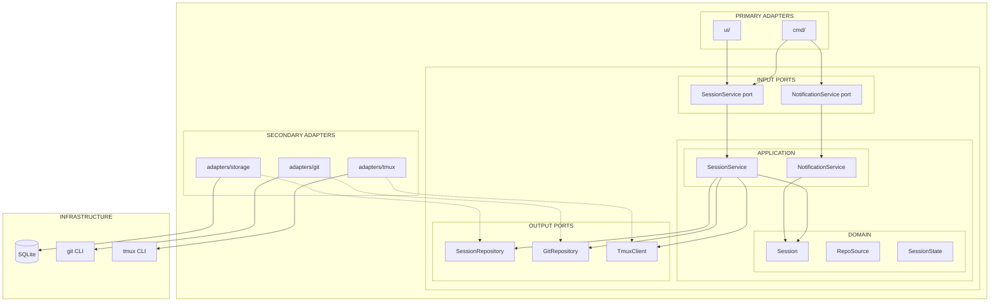

# Hexagonal Architecture Refactoring Plan

## Executive Summary

Refactor rocha to hexagonal architecture incrementally, maintaining backward compatibility throughout. The `tmux` package already demonstrates the pattern to follow.

## Target Architecture



**Layers (outside → center):** Infrastructure ← Adapters → Ports → Application → Domain

### Package Structure

```
rocha/
├── domain/                    # Pure Go domain entities (no dependencies)
│   ├── session.go             # Session entity
│   ├── repo_source.go         # RepoSource value object
│   └── errors.go              # Domain errors
│
├── ports/                     # Interface definitions (contracts)
│   ├── session_repository.go  # Storage port
│   ├── git_repository.go      # Git port
│   └── tmux.go                # Re-export existing tmux interfaces
│
├── application/               # Use cases / application services
│   ├── session_service.go     # Session lifecycle operations
│   └── notification_service.go# Hook event handling
│
├── adapters/                  # Infrastructure implementations
│   ├── storage/               # SQLite adapter
│   │   ├── sqlite_repository.go
│   │   ├── models.go          # GORM models
│   │   └── mappers.go         # Domain ↔ ORM conversion
│   ├── git/                   # Git CLI adapter
│   │   └── cli_repository.go
│   └── tmux/                  # Keep existing (already good!)
│
├── cmd/                       # CLI (driving adapter) - composition root
├── ui/                        # TUI (driving adapter)
└── (existing: logging, paths, config, version, sound)
```

## What Exists vs What's Needed

| Component | Current State | Target State |
|-----------|---------------|--------------|
| **tmux** | `Client` interface with composable sub-interfaces | Keep as-is, re-export in `ports/` |
| **storage** | Concrete `Store` struct, no interface | Extract `SessionRepository` interface |
| **git** | Package functions, no interface | Extract `GitRepository` interface |
| **domain** | Mixed in `storage/types.go` with ORM | Pure `domain/` package |
| **use cases** | Scattered in `ui/`, `operations/`, `cmd/` | Consolidate in `application/` |

## Port Interfaces to Define

Following the `tmux.Client` pattern: small composable interfaces (≤3 methods each).

### 1. Session Storage Ports (ports/session_storage.go)

```go
// SessionReader reads session data
type SessionReader interface {
    Get(ctx context.Context, name string) (*domain.Session, error)
    List(ctx context.Context, includeArchived bool) ([]domain.Session, error)
}

// SessionWriter creates, deletes, and reorders sessions
type SessionWriter interface {
    Add(ctx context.Context, session domain.Session) error
    Delete(ctx context.Context, name string) error
    SwapPositions(ctx context.Context, name1, name2 string) error
}

// SessionStateUpdater updates session state
type SessionStateUpdater interface {
    UpdateState(ctx context.Context, name string, state domain.SessionState, executionID string) error
    UpdateClaudeDir(ctx context.Context, name, claudeDir string) error
}

// SessionMetadataUpdater updates session metadata (flags, status, comments, archive)
type SessionMetadataUpdater interface {
    ToggleFlag(ctx context.Context, name string) error
    ToggleArchive(ctx context.Context, name string) error
    UpdateStatus(ctx context.Context, name string, status *string) error
    UpdateComment(ctx context.Context, name, comment string) error
}

// SessionRepository is the composite interface (like tmux.Client)
type SessionRepository interface {
    SessionReader
    SessionWriter
    SessionStateUpdater
    SessionMetadataUpdater
    Close() error
}
```

### 2. Git Ports (ports/git.go)

```go
// RepoInspector queries repository information
type RepoInspector interface {
    IsGitRepo(path string) (bool, string)
    GetMainRepoPath(path string) (string, error)
    GetRepoInfo(repoPath string) string
}

// WorktreeManager handles worktree lifecycle
type WorktreeManager interface {
    CreateWorktree(repoPath, worktreePath, branchName string) error
    RemoveWorktree(repoPath, worktreePath string) error
    RepairWorktrees(mainRepoPath string, worktreePaths []string) error
}

// RepoCloner handles repository cloning
type RepoCloner interface {
    GetOrCloneRepository(source, worktreeBase string) (string, *domain.RepoSource, error)
}

// GitRepository is the composite interface
type GitRepository interface {
    RepoInspector
    WorktreeManager
    RepoCloner
}
```

### 3. TmuxClient (ports/tmux.go)

```go
// Re-export existing interfaces (already well-designed)
type TmuxClient = tmux.Client
type TmuxSessionManager = tmux.SessionManager
type TmuxAttacher = tmux.Attacher
type TmuxPaneOperations = tmux.PaneOperations
type TmuxConfigurator = tmux.Configurator
```

### Interface Design Principle

Components request only the interfaces they need:

```go
// NotificationService only needs state updates
type NotificationService struct {
    stateUpdater ports.SessionStateUpdater
}

// SessionList only needs reading
func NewSessionList(reader ports.SessionReader) *SessionList

// Full repository for complex operations
type SessionService struct {
    storage ports.SessionRepository  // composite
    git     ports.GitRepository      // composite
    tmux    ports.TmuxClient         // composite
}
```

## Domain Entities to Extract

### domain/session.go (from storage/types.go)

```go
type Session struct {
    AllowDangerouslySkipPermissions bool
    BranchName                      string
    ClaudeDir                       string
    Comment                         string
    DisplayName                     string
    ExecutionID                     string
    IsArchived                      bool
    IsFlagged                       bool
    LastUpdated                     time.Time
    Name                            string
    Position                        int
    RepoInfo                        string
    RepoPath                        string
    RepoSource                      string
    ShellSession                    *Session
    State                           SessionState
    Status                          *string
    WorktreePath                    string
}

type SessionState string

const (
    StateIdle    SessionState = "idle"
    StateWorking SessionState = "working"
    StateWaiting SessionState = "waiting"
    StateExited  SessionState = "exited"
)
```

## Application Services to Create

### 1. SessionService (application/session_service.go)

Consolidates business logic from:
- `ui/session_form.go` → `CreateSession()`
- `ui/session_operations.go` → `KillSession()`, `ArchiveSession()`
- `operations/session_move.go` → `MoveSession()`, `DeleteSession()`

```go
type SessionService struct {
    git     ports.GitRepository
    storage ports.SessionRepository
    tmux    ports.TmuxClient
}

func (s *SessionService) CreateSession(ctx context.Context, params CreateParams) (*domain.Session, error)
func (s *SessionService) DeleteSession(ctx context.Context, name string, opts DeleteOpts) error
func (s *SessionService) KillSession(ctx context.Context, name string) error
func (s *SessionService) ArchiveSession(ctx context.Context, name string, removeWorktree bool) error
func (s *SessionService) MoveSession(ctx context.Context, params MoveParams) error
```

### 2. NotificationService (application/notification_service.go)

Consolidates logic from `cmd/notify.go`:

```go
type NotificationService struct {
    storage ports.SessionRepository
}

func (s *NotificationService) HandleEvent(ctx context.Context, session, event, execID string) error
```

## Migration Phases

### Phase 1: Foundation (Low Risk) - Additive Only

**Goal**: Create new packages without changing existing code.

1. Create `domain/session.go` - copy entities from `storage/types.go`
2. Create `domain/repo_source.go` - copy from `git/repo_source.go`
3. Create `domain/errors.go` - domain error types
4. Create `ports/session_repository.go` - interface definition
5. Create `ports/git_repository.go` - interface definition
6. Create `ports/tmux.go` - re-export existing interfaces

**Files to create**:
- `domain/session.go`
- `domain/repo_source.go`
- `domain/errors.go`
- `ports/session_repository.go`
- `ports/git_repository.go`
- `ports/tmux.go`

### Phase 2: Storage Adapter (Medium Risk)

**Goal**: Make storage implement the port interface.

1. Create `adapters/storage/models.go` - move GORM models from `storage/schema.go`
2. Create `adapters/storage/mappers.go` - domain ↔ ORM conversion
3. Create `adapters/storage/sqlite_repository.go` - implement `SessionRepository`
4. Wrapper delegates to existing `storage.Store` methods

**Backward compatibility**: Keep `storage.Store` working. New code uses interface.

### Phase 3: Git Adapter (Medium Risk)

**Goal**: Wrap git functions behind interface.

1. Create `adapters/git/cli_repository.go` - implement `GitRepository`
2. Delegates to existing `git/` package functions

### Phase 4: Application Services (Medium Risk)

**Goal**: Extract business logic into services.

1. Create `application/session_service.go`
2. Create `application/notification_service.go`
3. Extract logic from `ui/session_form.go`, `ui/session_operations.go`, `operations/`

### Phase 5: Composition Root (Low Risk)

**Goal**: Wire dependencies in cmd package.

1. Update `cmd/root.go` with factory functions
2. Update commands to use application services
3. Update `ui/` to receive services via DI

### Phase 6: Cleanup

**Goal**: Remove duplication.

1. Deprecate direct `storage.Store` usage
2. Move `operations/` logic fully into application services
3. Update `ARCHITECTURE.md` diagrams

## Critical Files to Modify

| File | Phase | Change |
|------|-------|--------|
| `storage/types.go` | 1 | Source for domain extraction |
| `storage/store.go` | 2 | Implement interface, keep methods |
| `git/worktree.go` | 3 | Source for adapter delegation |
| `ui/session_form.go` | 4 | Extract `createSession()` logic |
| `ui/session_operations.go` | 4 | Extract kill/archive logic |
| `operations/session_move.go` | 4 | Move to application service |
| `cmd/notify.go` | 4 | Extract to notification service |
| `cmd/root.go` | 5 | Composition root |

## Verification Plan

After each phase:

1. **Build**: `go build ./...` - no compilation errors
2. **Test**: `go test ./...` - existing tests pass
3. **Manual**: Run `rocha run --dev` and verify:
   - Session creation works
   - Session list displays correctly
   - Attach/detach works
   - Kill/archive works
   - Status cycling works

## Key Decisions

1. **Keep tmux interfaces as-is** - Already well-designed
2. **Adapters wrap existing code** - Minimize rewrite risk
3. **Domain uses concrete types** - No need for polymorphism in entities
4. **Maintain backward compatibility** - Each phase is independently deployable
5. **Incremental migration** - Can pause/revert at any phase
